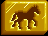
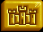

# Adventure/Action Buttons

Contains most useful actions to perform in game.

## Select Hero

Clicking it will activate your next hero (with mobility points left).

## Move

Clicking it will cause the active hero to continue his movement path (if one is displayed).

## Kingdom Overview

Opens [Kingdom Overview](/?selectedKind=KingdomOverviewWindow).

## End Turn

Clicking it ends current players turn.

- if any hero has mobility points, a confirmation modal pops up

## Adventure Options

Opens [Adventure Options](?selectedKind=AdventureOptions).

## Game Options

Opens [Game Options](?selectedKind=GameOptions).
