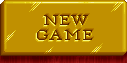
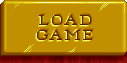
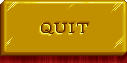

# Main Menu

Main menu of the game.

## New Game

Allows you to start a new game. Opens [Game Type Menu](/?path=/story/menu-gametypemenu--default).

## Load Game

Allows you to load a previously saved game. Opens [Game Type Menu](/?path=/story/menu-gametypemenu--default).

## View High Scores

Allows you to view high scores in various game types. Opens [High Scores Window](/?path=/story/highscoreswindow--default "High Scores Window").

## View Credits

Allows you to view game creators. Opens [Credits Window](/?path=/story/creditswindow--default "Credits Window").

## Quit

Returns you to your operating system.
